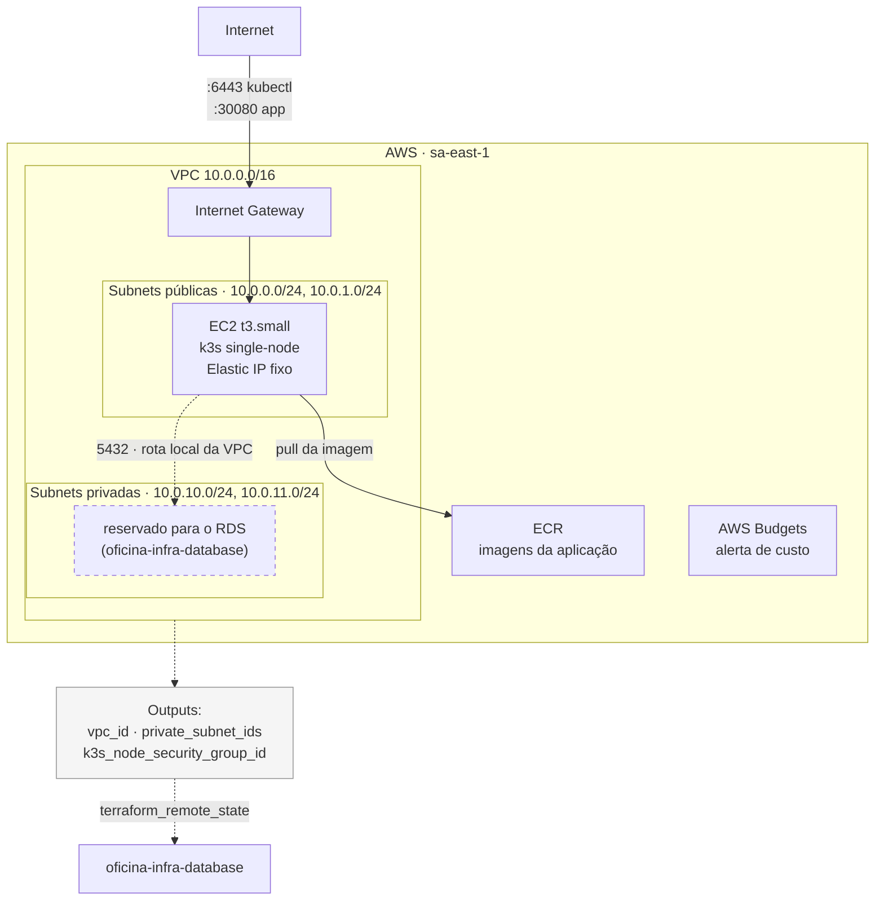

# oficina-infra-k8s

Infraestrutura de **rede e cluster Kubernetes** do sistema de gestão de oficina mecânica, provisionada com Terraform na AWS (`sa-east-1`).

Este é o **repositório base** do projeto: ele cria a VPC e o security group do nó, que os outros repositórios de infraestrutura consomem. Nada mais sobe antes dele.

> Parte do Tech Challenge SOAT — Fase 3. Repositórios irmãos:
> [`oficina-infra-database`](https://github.com/Luizustavo/oficina-infra-database) ·
> [`oficina-lambda-auth`](https://github.com/Luizustavo/oficina-lambda-auth) ·
> [`oficina-backend`](https://github.com/Luizustavo/oficina-backend)

---

## Propósito

| Recurso | Arquivo | Descrição |
|---|---|---|
| VPC + subnets | `vpc.tf` | 1 VPC, 2 subnets públicas (nó k3s) e 2 privadas (RDS), sem NAT Gateway |
| Nó Kubernetes | `ec2.tf` | 1 EC2 rodando k3s via user-data, com Elastic IP fixo, IAM role de leitura no ECR e acesso por SSM (sem SSH) |
| Registro de imagens | `ecr.tf` | ECR da imagem Docker da aplicação, com lifecycle mantendo só as 10 últimas |
| Alerta de orçamento | `budget.tf` | AWS Budgets — e-mail quando o gasto do mês passa de 50% e 100% do limite |

## Arquitetura deste repositório



### Por que k3s numa EC2, e não EKS

O control plane do EKS custa US$ 0,10/hora **sempre**, sem free tier. Uma EC2 `t3.small` e o RDS `db.t4g.micro` são cobertos pelo free tier de conta nova (750h/mês, primeiros 12 meses). Trocando EKS por k3s e removendo o NAT Gateway (o nó fica em subnet pública com IP direto), o custo cai de ~US$ 0,37/hora para perto de zero.

O trade-off: k3s não tem a integração da AWS para criar Load Balancers, então a aplicação é exposta via `NodePort` em `http://<ip-do-nó>:30080`. Na Fase 3 o API Gateway passa a ser a porta de entrada pública, e esse NodePort vira o backend dele.

Decisão registrada em `ADR-001` (repositório `oficina-backend`).

## Tecnologias

| Camada | Tecnologia |
|---|---|
| IaC | Terraform >= 1.11 (provider AWS ~> 5.0) |
| State remoto | S3 com lock nativo (`use_lockfile`) — sem DynamoDB |
| Orquestração | k3s (Kubernetes CNCF-conformant) |
| Computação | EC2 Amazon Linux 2023 |
| Registro | Amazon ECR |
| CI/CD | GitHub Actions |
| Acesso ao nó | AWS Systems Manager Session Manager |

---

## Pré-requisitos

- Terraform >= 1.11
- AWS CLI v2 com um profile configurado (`aws configure --profile oficina-fase2`)
- Usuário IAM com permissão para VPC, EC2, ECR, IAM roles, Budgets e S3

## Passo 1 — Bootstrap do backend (uma vez por conta AWS)

O bucket que guarda o state é o único recurso criado fora do Terraform — é o problema do ovo e da galinha: o Terraform precisa do bucket para guardar o state, e criar o bucket com Terraform geraria um state sem onde morar.

```bash
./scripts/bootstrap-backend.sh
```

Cria `oficina-backend-tfstate-<account-id>` com versionamento, criptografia AES256 e bloqueio total de acesso público. É idempotente — rodar de novo não quebra nada.

## Passo 2 — Aplicar

```bash
cp terraform.tfvars.example terraform.tfvars   # ajuste se quiser
terraform init
terraform plan
terraform apply
```

Leva ~2-3 minutos. Outputs relevantes:

| Output | Para quê |
|---|---|
| `k3s_instance_public_ip` | IP fixo do nó |
| `connect_via_ssm` | Comando pronto para abrir shell no nó, sem chave SSH |
| `app_url` | Onde a aplicação responde após o deploy no k8s |
| `ecr_repository_url` | Destino do `docker push` |
| `vpc_id`, `private_subnet_ids`, `k3s_node_security_group_id` | **Contrato consumido pelo repo do banco** |

## Passo 3 — Pegar o kubeconfig

```bash
$(terraform output -raw connect_via_ssm)     # abre shell no nó
sudo cat /etc/rancher/k3s/k3s.yaml           # copie o conteúdo
```

Na sua máquina, salve em `~/.kube/config-k3s`, troque `127.0.0.1` pelo IP público do nó e:

```bash
export KUBECONFIG=~/.kube/config-k3s
kubectl get nodes    # o nó deve aparecer como Ready
```

---

## CI/CD

`.github/workflows/terraform.yml`:

| Gatilho | O que roda |
|---|---|
| Pull Request para `main` | `fmt -check` → `init` → `validate` → `plan`, com o plan comentado no PR |
| Push em `main` | `apply` automático, com aprovação manual no Environment `production` |
| `workflow_dispatch` | `plan`, `apply` ou `destroy` sob demanda |

**Secrets necessários** em *Settings → Secrets and variables → Actions*:

| Secret | Valor |
|---|---|
| `AWS_ACCESS_KEY_ID` | Chave do usuário IAM de deploy |
| `AWS_SECRET_ACCESS_KEY` | Segredo correspondente |

**Proteção da branch `main`** (*Settings → Branches → Add rule*): exigir Pull Request, exigir o job `Plan` verde e bloquear push direto.

---

## ⚠️ Ordem de destroy

A rede daqui é pré-requisito do RDS. **Destrua sempre nesta ordem:**

```
1. oficina-infra-database   (terraform destroy)
2. oficina-infra-k8s        (terraform destroy)  ← este repositório
```

Invertendo, o destroy do banco falha por dependência órfã.

Ao final de cada sessão de trabalho, confirme que nada ficou ligado:

```bash
aws ec2 describe-instances --profile oficina-fase2 \
  --filters "Name=instance-state-name,Values=running" \
  --query "Reservations[].Instances[].InstanceId"   # deve voltar vazio
```

O `budget.tf` manda e-mail se o gasto passar dos limites, mas não confie só nisso — o `destroy` é o que realmente para o custo.

## Custo aproximado

| Recurso | US$/hora | Free tier (conta nova)? |
|---|---|---|
| EC2 t3.small | ~0,04 | Não (t3.micro seria, mas é pouca RAM para demonstrar o HPA) |
| EBS 20GB + tráfego | ~0,003 | Parcialmente |
| ECR, VPC, subnets, SGs | 0 | Sim |
| **Total** | **~US$ 0,04-0,05/hora** | |

## API

Este repositório não expõe API. A documentação Swagger da aplicação fica em [`oficina-backend`](https://github.com/Luizustavo/oficina-backend) e responde em `{app_url}/api/docs`.
